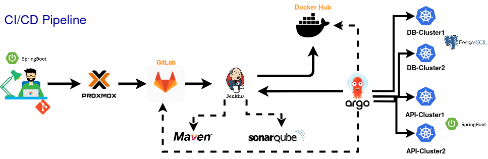

# Umfragen zu Selbsthilfe Themen

Bei dem Thema Selbsthilfe ist Diskretion eine wichtige Eigenschaft, damit Vertrauen und Akzeptanz bei vielen betroffenen Personen überhaupt möglich ist. Denn nicht jede Betroffene möchte die eigenen Probleme öffentlich austauschen und sich dadurch möglicherweise in den unerwünschten Scheinwerferlicht stellen lassen. Doch damit entsteht ein anderes Dillema: die betroffene Person tut sich so noch schwerer, um sich auf das Problem überhaupt einzulassen, weil der Schutz der Privatsphäre meist wichtiger ist. Darum können anonyme Umfragen hilfreich sein, um überhaupt festzustellen, wie viele Personen mit welchen Konflikten zu kämpfen haben. Das kann sowohl den Betroffenen als auch den Helfenenden zumindest als eine kleine Ortientierung dienen, um der eigentlichen Hilfe ein Stück näher zu kommen.

Mit Umfragen verfolgt auch www.Anonym-Chat.de ein ähnliches Ziel, um festzustellen, ob sich die Plattform in die richtige Richtung bewegt. So entsteht auch die anonyme Möglichkeit die Wünsche der Teilnehmer zu erfahren, ohne die persönlichen Daten der Nutzer zu benötigen. Für erweiterte Zwecke können solche Umfragen dann auch für Studienzwecke herangezogen werden, um einen Ausschnitt der Gesamtsituation beim Thema Selbsthilfe zu analysieren und wenn nötig zu bewerten.

Bei dem aktuellen Projekt werden wir uns daher an eine Architektur ortientieren, die eine hoch skalierbare Umfrage-Plattform aufbaut, bei der auch künftige Versionen einfach erweiterbar sind. Zu Beginn wird die nach Außen sichtbare Web-Applikation nur wenig Inhalt haben. Letztenendes dient uns diese Vorlage als Basis für eine größere Bandbreite verschiedener Umfrage-Konzepte.

## Architekturkonzept

### Erläuterung des Konzepts

- Anwendung wird mit <b>Spring Boot</b> nach der <b>Hexagonalen</b> Architektur (nach dem DDD-Prinzip) aufgebaut. Die Umfrageergebnisse werden in der <b>Postgresql</b> Datenbank persistiert.
- Statt nur ein System zu nutzen, teilen wir verschiedene Anwendungen mithilfe der Virtualisierungsplattform <b>Proxmox</b> auf mehrere Server auf.
- Die Bereitstellung der Sourcecodes realisieren durch <b>Gitlab</b>.
- Das Deployment triggern wir mit <b>Jenkins</b>, wo wir durch Pipelines den Build-Ablauf beschreiben. Mit <b>Sonarqube</b> wird der Code auf Qualität geprüft und mit <b>Maven</b> werden schließlich die Binaries gebaut.
- Erfüllt der Code die Qualitätskriterien, wird der Build-Container in <b>Docker Hub</b> hochgeladen.
- Mit <b>ArgoCD</b> wird Jenkins abgefragt, ob es eine neue gültige Version bereitsteht und falls ja, wird der Build aus Docker Hub und <b>Kubernetes</b> Schemata aus Gitlab geladen und der Relase damit aktualisiert und in mehreren Clustern repliziert und synchronisiert.

## weitere Infos
Eine erweiterte Beschreibung, sowie Tipps finden Sie unter dem Verzeichnis [Zusätzliche Informationen](/additional_infos) bzw. 'additional_infos/'

## Änderungsverlauf
Sofern aktuell, befinden sich historische Änderungen unter [Änderungsübersicht](additional_infos/history.md)
