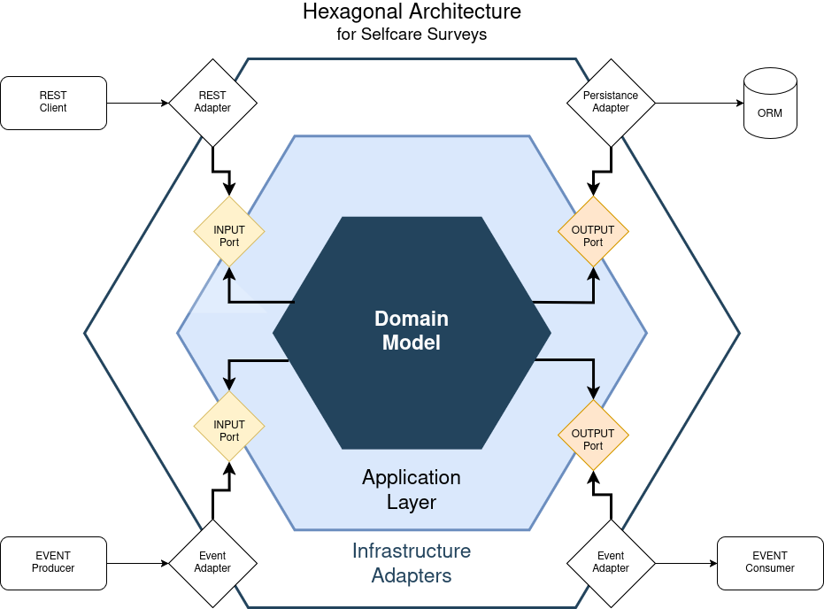

# Applikation implementieren

Die Implementierung der Software erfolgt bei uns mit Spring Boot. Aus strategischer Überlegung entscheiden wir uns für die hexagonale Architektur.
Dadurch erhalten wir die Möglichkeit die Business Logik von der äußeren Infrastruktur zu trennen, um später eine höhere flexibilität für Erweiterungen zu ermöglichen.

## Architektur Konzept



## Architektur Vorüberlegungen

Nach dem Domain-Driven Design Prinzip wählen wir unsere Core-Domain im UserCase Bereich "Umfragen generieren". In einem größeren unternehmerischen Gedankenvorhaben könnte damit unser Geschäftsmodell bei beliebigen Umfragen und der daraus generierten Daten liegen.

### Domain Model

Nach unserer Grafik, beinhaltet unser Domain Model die für uns relevanten Eintitäten zu den Umfragen (Surveys), die wiederum aus mehreren Fragen und Antworten bestehen können. Die Fragen selbst können mehrfache oder einfache Antworten zulassen. Zusätzlich möchten wir als Sub-Domain alle getätigten Umfragen durch ein Event-Protokoll festhalten. Das kann als Nachricht z.B. per E-Mail versendet werden, wenn wir die Teilnehmer irgendwie informieren wollten. Doch wir entscheiden uns zunächst lediglich für eine Konsolenausgabe.

### Application Layer

Die Application Schicht stellt uns mehrere <b>INPUT/OUTPUT-Ports</b> zur Verfügung, um die Verbindung zwischen der äußeren Infrastruktur und dem Domain Model zuzulassen. Hier stellen wir sicher, dass die Umfragen erstellt werden und die Ergebnisse davon abgerufen werden können. Außerdem möchten wir, dass bei jeder neu erzeugten Umfrage ein Event ausgelöst wird, der uns vom neuen Ereignis in Kenntnis setzt.

### Infrastructure Adapters

Die äußere Infrastruktur bauen wir nach dem Selfcare (Selbsthilfe) Charakter. Vom Prinzip her könnten wir in Zukunft diese Schicht in ein anderes Themengebiet umbauen z.B. für Produktbewertungen. Um es einfacher zu halten erhalten die Umfragen zur Selbsthilfe nur eine mögliche Antwort. Deshalb konvertieren wir unsere Daten mithilfe eines Mappers in das richtige Format nach dem Domain Model.
Die Speicherung der Daten erfolgt durch den <b>Persistance Adapter</b> nach Postgresql (<b>ORM</b>). Mit der WEB- und <b>REST-Client</b> Schnittstelle gibt der Teilnehmer die Daten für eine Umfrage ein und kann anschließend die Statistik in einer Tabelle einsehen. Die Eingabe löst ein <b>Event</b> aus (<b>Event Producer</b>), wodurch im Anschluss eine Consolen-Ausgabe erfolgt (<b>Event Consumer</b>), die anzeigt, welches Thema der Teilnehmer ausgewählt hat und ob dieser eine Nachricht und Kontaktadresse mit angegeben hat. Alle Adapter können flexibel jederzeit ausgetauscht werden, ohne das andere Schichten davon berührt werden müssen.

## Implementierung und Start

Der implementierte Code richtet sich nach streng nach dem hexagonamel Model und die Aufteilung erfolgt hierarchisch durch Java Pakete. Auf den ersten Blick erscheint der Aufbau etwas Überdimensioniert, doch wie oben bereits angemerkt, gehen wir hier von einem größeren Vorhaben aus, wo wir auch andere Use-Cases vorsehen können, z.B. indem wir Kategorien von Probanden für Studienzwecke mit berücksichtigen.
Bevor der Start erfolgen kann, muss noch unter Postgres eine Datenbank angelegt werden, was unter Ubuntu wie folgt stattfinden kann:


```
sudo apt install postgresql

sudo -i -u postgres

postgres@workbook:~$ psql -U postgres
psql (14.17 (Ubuntu 14.17-0ubuntu0.22.04.1))
Type "help" for help.

postgres=# CREATE USER max WITH PASSWORD 'musterPassword';
CREATE ROLE
postgres=# CREATE DATABASE survey;
CREATE DATABASE
postgres=# GRANT ALL PRIVILEGES ON DATABASE survey to max;
GRANT
postgres=# \c survey
You are now connected to database "survey" as user "postgres".
```

Nun startet die Applikation mit Maven z.B. wie folgt:

```
mvn clean package
```
