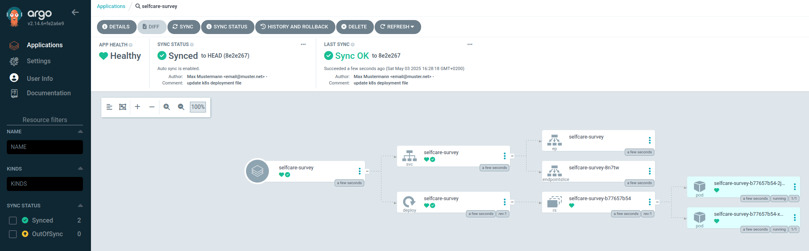
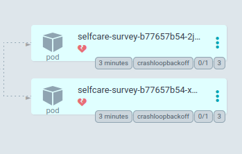

# Veröffentlichung mit ArgoCD

Nach unserem Architekturkonzept unter [Architekturkonzept](https://github.com/SchmidtWaldemar/selfcare-survey#architekturkonzept) kommen wir nun zum letzten Punkt, wo wir unsere Spring Applikation mithilfe von ArgoCD veröffentlichen. Das besondere an ArgoCD ist, dass unsere Deployments praktisch nahtlos von einer in die andere Version wechseln und wir uns um Unterbrechungen keine Sorgen machen müssen. Außerdem können wir mithilfe von Kubernetes die Cloud-Ausfälle durch Replikationen reduzieren und haben zudem noch eine gute Übersicht von unseren Cluster.

## ArgoCD und Deployment Server installieren

Damit unsere Cluster Lösung sich möglichst nah an der Praxis richtet, installieren wir zwei Ubuntu Systeme unter Proxmox. Auf dem einen System läuft dann ArgoCD und auf dem Anderen ein Kubernetes Cluster. Auf beiden Systemen verwenden wir gleiche Hardwareanforderungen und wählen den Hostnamen so, dass wir es später gut voneinander unterscheiden können. Insgesamt erhalten wir bei uns folgende Systemparameter:

- CPU: 2 virtuelle Kerne
- RAM: 5 GB
- Festplatte: 55 GB
- Betriebssystem: ubuntu-22.04.5-live-server-amd64
- Hostname ArgoCD: argocd
- Hostname k8s-Cluster: deploy-k8s
- IP ArgoCD: 192.168.178.31
- IP k8s-Cluster: 192.168.178.109

### Systeme aktualisieren

Damit wir das System aktuell haben und später die wichtigsten Tools an Bord haben, rufen wir folgende Befehle auf:

```
sudo apt update
sudo apt upgrade

# um die IP zu ueberpruefen
sudo apt install net-tools

# um später einen SSH Tunnel einzurichten
sudo apt install openssh-server
```

### Kubernetes installieren
Nun können wir nach der Anleitung bei beiden Systemen Kubernetes installieren:

https://kubernetes.io/docs/tasks/tools/install-kubectl-linux/

Oder stattdessen diese Befehle auf beiden System aufrufen:

```
# falls fuer Ingress nginx statt traefik genutzt werden soll
sudo curl -sfL https://get.k3s.io | INSTALL_K3S_EXEC="--disable traefik" K3S_KUBECONFIG_MODE="644" sh -
mkdir .kube
cd .kube/
sudo cp /etc/rancher/k3s/k3s.yaml ./config
sudo chown $(id -u):$(id -g) $HOME/.kube/config
chmod 400 config
export KUBECONFIG=~/.kube/config
```

### ArgoCD installieren

Auf dem 192.168.178.31 Server installieren wir ArgoCD nach der Anleitung wie unter:

https://argo-cd.readthedocs.io/en/stable/

```
kubectl create namespace argocd
kubectl apply -n argocd -f https://raw.githubusercontent.com/argoproj/argo-cd/stable/manifests/install.yaml
```

Wir möchten auf die UI später durch Port Forwarding zugreifen und passen den Service Typ auf den NodePort wie folgt an:

```
kubectl patch svc argocd-server -n argocd -p '{"spec": {"type": "NodePort"}}' 
```

Nun bauen wir uns einen Tunnel zwischen unterem Arbeitsrechner und dem ArgoCD Server. Dazu stellen wir zunächst sicher, unter welchem Port der ArgoCD Server läuft:

```
kubectl get svc -A

...
argocd        argocd-repo-server                        ClusterIP   10.43.198.52    <none>        8081/TCP,8084/TCP            22d
argocd        argocd-server                             NodePort    10.43.97.194    <none>        80:30858/TCP,443:30716/TCP   22d
argocd        argocd-server-metrics                     ClusterIP   10.43.162.46    <none>        8083/TCP                     22d
...
```

Es werden mehrere Kubernetes Instanzen angezeigt, wobei uns nur der argocd-server als NodePort interessiert. Wir können nun den Port Forward entweder unter dem Port 80 oder 443 durchführen. Port 80 leitet uns intern ohnehin auf 443 um, weshalb wir auf dem ArgoCD Server den folgenden Befehl aufrufen:

```
kubectl port-forward -n argocd svc/argocd-server 8080:443
```

Die Konsole lassen wir nun dauerhaft unangetastet so laufen und öffnen eine neue Comman-Konsole, wo wir uns erneut mit dem ArgoCD Server anmelden, allerdings diesmal in einem SSH Tunnel, wobei den &lt;user&gt; ersetzen Sie durch Ihren eigenen Benutzernamen:

```
ssh -L 8080:localhost:8080 <user>@192.168.178.31
```

Nun befinden wir uns mit der neuen Konsole wieder auf dem ArgoCD Server, allerdings kennt die Konsole die Config Datei, die ArgoCD bei der Kubernetes Verbindung benötigt, weshalb wir erneut diesen Befehl aufrufen und in den nächsten Schritten diese Konsole bei ArgoCD nutzen:

```
export KUBECONFIG=~/.kube/config
```

Nun rufen wir ArgoCD UI auf dem Browser wie folgt auf:

https://localhost:8080

Der Benutzername hier lautet 'admin' und das Passwort finden wir wie folgt heraus:

```
kubectl -n argocd get secret argocd-initial-admin-secret -o jsonpath="{.data.password}" | base64 -d
```

Dieses Passwort speichern wir zwischen, da wir es noch für die Registrierung der Cluster benötigen.

### ArgoCD mit Cluster verbinden

Am Anfang haben wir den Server unter der IP 192.168.178.109 für unseren Deployment Cluster installiert und Kubernetes darauf installiert.
Auf diesem Server kopieren wir den Inhalt der Config Datei, den wir wie folgt ausgeben lassen:

```
cat ~/.kube/config
```

Auf dem ArgoCD Server erstellen wir eine neue Datei und speichern den Inhalt des Clusters rein und ändern hier die IP Adresse von 'https://127.0.0.1:6443' auf 'https://192.168.178.109:6443':

```
vi ~/.kube/deploy-k8s-cluster.yaml
sed -i 's/127.0.0.1/192.168.178.109/g' ~/.kube/deploy-k8s-cluster.yaml
```

Um den Cluster unter ArgoCD registriren zu können, müssen wir noch ein weiteres Tool auf dem ArgoCD Server installieren:

```
curl -sSL -o argocd-linux-amd64 https://github.com/argoproj/argo-cd/releases/latest/download/argocd-linux-amd64
sudo install -m 555 argocd-linux-amd64 /usr/local/bin/argocd
rm argocd-linux-amd64
```

Wir überprüfen, ob wir uns noch die ArgoCD UI aufrufen können, indem wir schauen, ob ein gültiges HTML angezeigt wird:

```
curl -k https://localhost:8080
```

Falls ja, können wir diese Adresse nun zum Login bei ArgoCD nutzen, ignorieren hier die Zertifikatsmeldung und geben 'admin' sowie das Passwort ein, das wir bereits oben gespeichert haben:

```
$ argocd login localhost:8080
WARNING: server certificate had error: tls: failed to verify certificate: x509: certificate signed by unknown authority. Proceed insecurely (y/n)? y
Username: admin
Password: 
'admin:login' logged in successfully
Context 'localhost:8080' updated
```

Bevor wir den Deployment Cluster registrieren, sollten wir noch sicherstellen, dass wir den richtigen Namen davon verwenden:

```
$ kubectl get nodes
NAME         STATUS   ROLES                  AGE   VERSION
deploy-k8s   Ready    control-plane,master   21d   v1.32.3+k3s1
```

Nun können wir diesen Namen wie folgt für die Registrierung verwenden und bestätigen hier mit 'y':

```
argocd cluster add default --name deploy-k8s
```

Nun sollten wir im Browser unter den Settings den neuen Cluster erkennen können:

https://localhost:8080/settings/clusters

Damit wäre die Cluster Verbindung durch und bevor wir uns der eigentlichen Veröffentlichung der Spring Applikation widmen können, müssen wir Kubernetes einige Script Anweisungen bereitstellen.

### Repository aus Gitlab verbinden

Als nächstes möchten wir unter ArgoCD ein Repository von unserem Gitlab Projekt hinzufügen. Dazu benötigen wir als erstes einen Zugangstoken, den wir unter Gitlab erstellen. Bei Gitlab klicken wir dazu auf Settings > Access tokens. Der Token Name kann beliebig lauten und wir wählen die Rolle Guest aus, da wir nur einfache Zugriffsrechte benötigen und unser Projekt ohnehin durch 'Public' zugänglich ist. Doch Achtung: das Verfallsdatum unter "Expiration date" muss gut überlegt sein. Sobald dieser abgelaufen ist, kann ArgoCD nicht mehr auf unsere Repository zugreifen und damit keine neuen Updates holen. D.h. ArgoCD wird zwar unseren Deployment weiterhin als Verfügbar halten, doch neue Updates bzw. Versionen wird es künftig nicht abholen können, bis wir die Verbindung mit einem neuen Token ergänzt haben.

Nun gehen wir zu ArgoCD und klicken dort auf Settings > Repositories. Dann klicken wir auf 'CONNECT REPO' und tragen folgende Parameter ein:

Choose your connection method:
HTTPS

Name (optional)
repo-connection

Username (optional)
root

Password (optional)
Gast token von Gitlab

Repository URL
http://192.168.178.186/selfcare/selfcare-survey.git

Achtung: hier tragen wir die IP Adresse von Gitlab ein, da der Deployment und ArgoCD Server die Domain 'gitlab.local' nicht übersetzen können (zumindest habe ich keinen Weg dazu gefunden). Beim Klick auf 'CONNECT' sollten wir einen grünen Icon sehen, dass die Verbindung geklappt hat. 

Achtung: sollte die Verbindung nicht geklappt haben, müssen die alten Einträge erst entfernt werden, da ArgoCD sich nicht korrekt (zum zweiten mal) verbinden kann, wenn die Repository URL gleich ist.

Sobald die Verbindung erfolgreich ist, können wir auf die drei grünen Punkte rechts klicken und auf 'Create application'. Dann setzen wir folgende Parameter:

Bei GENERAL tragen wir ein:

Application Name
selfcare-survey

Project Name
default

Sync Policy
'Automatic' auswählen

Dann wählen wir per Einhaken:

- Prune Resources
- Self Heal 


Bei SOURCE geben wir ein:

Repository URL
bleibt bei http://192.168.178.186/selfcare/selfcare-survey.git

Revision
wenn wir master Branch nutzen, dann bleibt der Eintrag bei HEAD

Path
./k8s/

Achtung: der Path ist in unserem Spring Projekt der k8s Ordner, wo unsere Kubernetes Konfigurationsdateien enthalten sind. Diese Dateien verwendet ArgoCD für das Deployment. Hier sollten Sie statt 'schmidtwaldemar' Ihren Benutzernamen eintragen, den Sie von Docker Hub haben. Der Rest sollte zunächst passen.

Unter DESTINATION tragen wir ein:

Cluster URL
https://192.168.178.109:6443

Namespace
default

Der Rest sollte dann soweit passen und wir klicken oben auf 'Create'.

Nun haben wir es geschaft und wir erhalten beim Klick auf die Applikation z.B. indem wir auf 'selfcare-survey' klicken folgendes Ergebnis:



Doch das Ergebnis täuscht in Wirklichkeit. Im Laufe der Zeit erhalten wir Fehlermeldungen, die sich wie folgt äußern:



Wenn wir auf einen der grünen Cluster klicken und dann auf 'LOGS', sehen wir, dass die Applikation nicht gestartet werden kann, weil wir keine Datenbankverbindung haben.

## was uns in der nächsten Beschreibung erwartet ...

In der nächsten Beschreibung werden wir sicherstellen, dass unsere Applikation eine Datenbankverbindung erhällt. Dazu werden wir weitere Kubernetes Container hinzufügen und die Verbindungsparameter darauf verweisen. 
Außerdem werden müssen wir die Versionierung anpssen, damit ArgoCD mitbekommen kann, dass unter Docker Hub statt 'latest' eine neue Version bereitgestellt wird. Hier nutzen wir eine weitere Pipeline aus, in der wir die Version innh. der deployment.yaml Datei ändern. 
