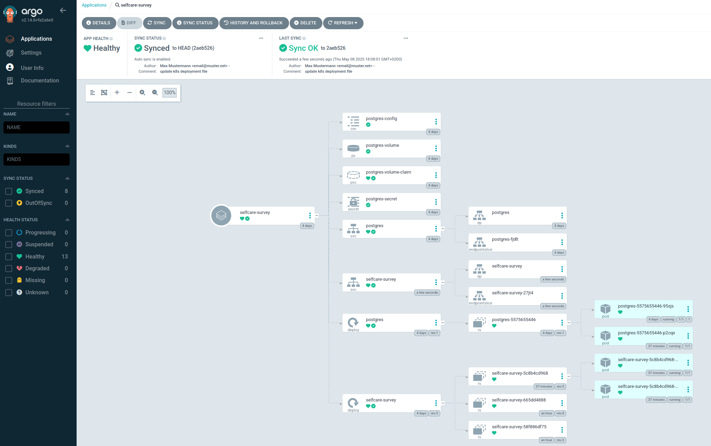
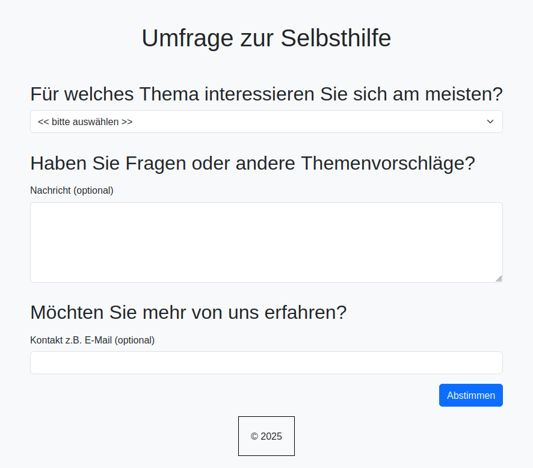
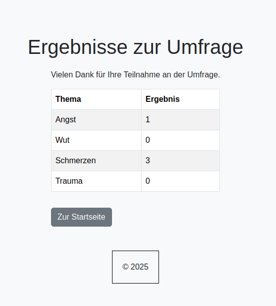

# Versionierung, Persistierung und CI/CD Komplettierung

In der finalen Beschreibung wollen wir unsere Spring Applikation mit einer Datenbank mithilfe von Kubernetes verbinden. Anschließend soll ArgoCD statt 'latest' eine exakte Versionen erhalten, indem wir dynamisch nach dem Deployment die Versionsnummer in die deployment.yaml Datei schreiben. Zum Schluss stellen wir unsere Umfrage Seite im Browser dar und geben eine kurze Aussicht für alternative Anwendungsfälle, die neben der hier beschriebenen möglich sind.

## Datenbank Verbindung aufbauen

Unter der 'src/main/resources/application.yml' haben wir die Parameter dynamisch angepasst, damit wir sowohl lokal, als auch nach dem Deployment die Inhalte aus den Kubernetes Konfigurationsdateien auslesen können. Im './k8s/' Verzeichnis befindet sich eine neue Datei 'db-deployment.yaml', in der die Datenbank 'postgresql' durch ArgoCD geladen und gestartet wird. Der Parameter 'POSTGRES_PASSWORD' wird mit 'Secret' Steuerung verwaltet, wo wir das Passwort vorher in Base64 codieren. Die Kodierung erfolgt z.B. durch den folgenden Befehlsaufruf:

```
echo -n "musterPassword" | base64
```

Der Zusatzparameter '-n' ist besonders wichtig, da sonst am Ende des Passworts ein Zeilenumbruch hinzgefügt wird und das Passwort damit nicht mehr ausgelesen werden kann. 
Das Passwort selbst können Sie natürlich beliebig selbst bestimmen und nicht bei 'musterPassword' belassen. Gleiches gilt natürlich auch für andere Parameter.

## neue Pipeline erstellen

Wir gehen bei Jenkins auf das Dashboard und klicken auf "+ Element anlegen". Nun benennen wir die neue Pipeline z.B. 'version-refresh-pipeline' und wählen Pipeline aus und auf Erstellen.
Dann wählen wir 'Alte Builds verwerfen' aus und setzen 'Maximale Anzahl an Builds, die aufbewahrt werden' z.B. auf 3.
Dann wollen wir an diese Pipeline Parameter senden (in diesem Fall die Versionsnummer) und diese nach dem Empfang verarbeiten. Wir wählen also 'Dieser Build ist parametrisiert' aus und fügen einen Paramter als 'Text-Parameter' hinzu.
Den Namen setzen wir z.B. als 'VERSION_VALUE' und lassen den Rest leer.
Weiter unten gehen wir nun zu 'Triggers' und wählen da 'Builds von außerhalb starten (z.B. skriptgesteuert)' aus. Hier können wir den Authentifizierungstoken z.B. 'auth-token' nennen. Dieser Token sagt unserer Pipeline quasi, dass wir dem einen neuen Wert übermitteln (die Version) und dass dieser den nun verarbeiten kann.
Bei der Pipeline Definition wählen wir 'Pipeline script from SCM' aus. Bei SCM ändern wir die Auswahl auf 'Git' und bei Repository URL tragen wir den Gitlab Repository ein, den wir für unser Projekt verwenden, also 'http://gitlab.local/selfcare/selfcare-survey'. Bei den Credentials wählen wir nun die Zugangsdaten unseres Gitlab aus, damit die Verbindung zum Repository möglich wird. Weiter unten tragen wir wie bei unserer letzten Pipeline den Branch '*/master' ein, auf den wir die Version später ändern möchten.
Weiter unten haben wir unseren 'Script Path'. Hierzu haben wir eine neue Datei 'Jenkinsfile_Version' angelegt, wo die neue Pipeline die Konfigurationen herholen soll. Diesen Dateinamen tragen wir nun hier ein. Den rest lassen wir unverändert und klicken auf 'Save'.

## Zugangstoken erstellen

Als nächstes benötigen wir noch einen Zugangstoken, womit wir mit unserer Pipeline oben einen direkten Zugriff ermöglichen. Dazu gehen wir im Topmenü rechts auf unseren Benutzer (links neben Abmelden) und von dort aus auf Security. Dann klicken wir auf den Button 'Add new Token' und bennen diesen Token z.B. mit 'JENKINS_API_TOKEN'. Den Token kopieren wir am besten und speichern es auf einer sicheren Stelle, da wir danach keinen Zugriff mehr darauf haben werden. Diesen Token verwenden wir innerhalb unserer Jenkinsfile, wo wir einen Aufruf der neuen Pipeline triggern.
Dann benötigen wir noch einen weiteren Token, mit dem wir unter Jenkins einen Schreibzugriff auf das Gitlab Repository haben. Dazu gehen wir zu Gitlab und Settings > Access tokens einen solchen Token an, wo wir im Idealfall Developer oder Owner Rolle erhalten. Diesen Token fügen wir unter Credentials unter Jenkins neu an, indem wir auch hier die Kategorie 'Benutzername und Passwort wählen'. Die ID nennen wir bei der Jenkinsfile_Version Datei 'deployment-token', wo der 'git push' stattfindet.

## Anpassung de Jenkinsfiles

Jetzt wo wir die oben genannten Einstellungen durchgeführt haben, müssen wir unter Umständen die 'Jenkinsfile' und 'Jenkinsfile_Version' anpassen. Bei der Jenkinsfile steht unter 'Version Tag Trigger' bei der URL die von uns angegebene Parameter wie Projektname 'version-refresh-pipeline', Datenparameter wie 'VERSION_VALUE', HTTP Get-Parameter bzw. Authentifizierungstoken 'auth-token'. Falls diese Parameter bei Ihnen anders lautet, sollte dies geändert werden. Unter der Jenkinsfile_Version sollten ähnliche Anpassungen vorgenommen werden. Darin ist z.B. die Variable 'VERSION_VALUE', die nach dem Empfang verwendet wird und u.U. geändern werden muss.

Sobald wir alles richtig angepasst haben und unter Jenkins den Build aufgerufen haben, sollte im Erfolgsfall automatisch die Pipeline 'version-refresh-pipeline' gestartet werden und uns die Version in der deployment.yaml Datei verändern. Das wiederum führt dazu, dass ArgoCD die Änderung mitbekommt und die Synchronisation entsprechend startet. Außerdem haben wir so eine gute Übersicht innerhalb von ArgoCD, unter welchem Versionsstand die Applikation gerade läuft.

Am Ende sollte ArgoCD uns in etwa folgende Übersicht anzeigen:



## SSH Tunnel zur Web-Anzeige

Wir haben einfachheithalber auf Ingress Steuerungen zur Anzeige der Web-Oberfläche verzichtet. Stattdessen können wir eine noch kompliziertere Lösung vornehmen, um den Aufruf des 'selfcare-survey' unter Kubernetes in den lokalen Rechner umzuleiten:

```
# Port weiterleitung innh. des argocd Servers
kubectl port-forward -n argocd svc/argocd-server 8080:443

# auf dem deploy-k8s Server aufrufen und Cluster-IP von selfcare-survey entnehmen
kubectl get svc -A

NAMESPACE     NAME              TYPE        CLUSTER-IP      EXTERNAL-IP   PORT(S)                  AGE
default       kubernetes        ClusterIP   10.43.0.1       <none>        443/TCP                  4d4h
default       postgres          ClusterIP   10.43.131.239   <none>        5432/TCP                 4d4h
default       selfcare-survey   ClusterIP   10.43.244.114   <none>        8081/TCP                 3m40s
kube-system   kube-dns          ClusterIP   10.43.0.10      <none>        53/UDP,53/TCP,9153/TCP   4d4h
kube-system   metrics-server    ClusterIP   10.43.177.187   <none>        443/TCP                  4d4h

# Cluster IP verwenden und den SSH-Tunnel starten
ssh -L 8081:10.43.244.114:8081 <user>@deploy-k8s
```

Nachdem wir die oben genannten Aufrufe durchgeführt haben, können wir auf dem Browser die folgende Adresse aufrufen und unsere Web-Oberfläche nutzen:

http://localhost:8081/

Nun können wir unsere Abstimmungen z.B. wie folgt durchführen:





## Troubleshoots

Während der Konfiguration können kleine Ungereinheimten auftreten, zu denen wir hier ein paar Tips und Tricks für eine Lösung benennen möchten.

### Trigger URL fehlerhaft

Bei der Pipeline Trigger URL innerhalb der Jenkinsfile haben wir die Adresse 'http://jenkins.local' angegeben. Dieser Aufruf kann fehlschlagen, wenn unter dem Jenkins Agent die 'jenkins.local' nicht bekannt ist. Das sollten wir vor allem beim Server, wo der Jenkins Agent läuft nachholen. Wo sich der Agent genau befindet, haben wir unter [Jenkins konfigurieren](https://github.com/SchmidtWaldemar/selfcare-survey/blob/main/additional_infos/03_configure_gitlab_and_jenkins.md#jenkins-konfigurieren) beschrieben. Hier tragen wir bei unserem Agenten unter /etc/hosts den Eintrag '192.168.178.117  jenkins.local' ein und danach sollte der Build klappen.

### Doppelte Versionänderung bei Git

Bei unserer Lösung werden die 'k8s' Konfigurationsdateien im gleichen Projekt hinterlegt. Das kann beim Deployment störend sein, da wir bei jedem 'git push' automatisch einen weiteren 'push' auslösen, wo die Versionsnummer in der deployment.yaml Datei verändert wird. Dadurch lässt sich ein weitere manueller 'git push' meistens nur nach einem Merge-Konflikt durchführen. D.h. wir müssen die Änderung inder deployment.yaml erst mit unserer Version synchronisieren, bevor wir die Freigabe zum Push erhalten.
Besser wäre es daher den Inhalt des './k8s/' Verzeichnisses in ein weiteres Projekt zu packen, der entkapselt von unserem Haupt-Repository läuft. Oder wir verwenden einen neuen Branch, den wir z.B. 'deployment' nennen. Wir haben es in diesem Projekt so gelöst, damit wir nicht bei GitHub zu Irritationen kommen und die Übersichtlichkeit bewahrt bleibt.
Sollte es daher zu einem Merge Konflikt kommen, könnt ihr diesen mit dem folgenden Befehl korrigieren:

```
git merge
```

### Synchronisationsprobleme bei ArgoCD

Bei unseren Tests haben ich mal die Datenbank Cluster Postgresql auch innerhalb eines anderen Projekts wiederverwendet. Der Datenbankname sollte hier zwar ein anderes sein, aber die Namen wie Volumes und Claims blieben die gleichen. Zunächst wollten ich, dass durch die Parameter unter 'db-deploy.yaml' ArgoCD uns eine neue Datenbank automatisch anlegt, doch das passierte nicht. Anschließend kam es unter ArgoCD zu Synchronisationsproblemen, besonders dann, als ich die Namen wie 'postgres-volume-claim' ändern und damit erzwingen wollten, dass ich neue Services und Pods erhalten. Stattdessen konnte ArgoCD den Synchronisationsprozess von den alten Werten wie Namen nicht mehr korrekt beenden und auch eine harte Terminierung klappte nur bedingt. Zum Schluss habe ich keine passable Lösung gefunden, um die alte Datenbank überhaupt vom System restlos zu entfernen, was dazu führte, dass nur durch ein komplettes Neuaufsetzen des Systems (deploy-k8s Server) geholfen hat.
Ob es sich hier um einen Bug bei ArgoCD handelt oder Kubernetes bestimmte Einstellungen erforderlich macht, konnte ich leider nicht genau bestimmen. Sollte Jemand eine Antwort auf ein ähnliches Verhalten finden, kann gerne ein Kommentar zukommen lassen.

### Kubernetes Konfigurationsdatei automatisch laden

Wenn wir z.B. auf den Server von argoCD oder deploy-k8s wechseln, müssen wir den Aufruf 'export KUBECONFIG=~/.kube/config' immer wieder manuell ausführen, damit wir mit 'kubctl' unsere Konfigurationen vornehmen können. Damit wir diesen manellen Schritt überspringen können, können Sie den folgenden Aufruf tätigen, damit das in Zukunft automatisch passiert:

```
echo "export KUBECONFIG=~/.kube/config" >> .bashrc
```

